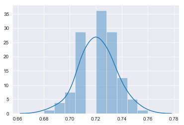

+++
title = "Nb1"
subtitle = ""

# Add a summary to display on homepage (optional).
summary = ""

date = 2019-03-27T14:00:23-07:00
draft = false

# Authors. Comma separated list, e.g. `["Bob Smith", "David Jones"]`.
authors = []

# Is this a featured post? (true/false)
featured = false

# Tags and categories
# For example, use `tags = []` for no tags, or the form `tags = ["A Tag", "Another Tag"]` for one or more tags.
tags = []
categories = []

# Projects (optional).
#   Associate this post with one or more of your projects.
#   Simply enter your project's folder or file name without extension.
#   E.g. `projects = ["deep-learning"]` references 
#   `content/project/deep-learning/index.md`.
#   Otherwise, set `projects = []`.
# projects = ["internal-project"]

# Featured image
# To use, add an image named `featured.jpg/png` to your page's folder. 
[image]
  # Caption (optional)
  caption = ""

  # Focal point (optional)
  # Options: Smart, Center, TopLeft, Top, TopRight, Left, Right, BottomLeft, Bottom, BottomRight
  focal_point = ""
+++ 


```python
import pandas as pd
from sklearn.model_selection import train_test_split
from sklearn import svm
from sklearn.metrics import classification_report
from sklearn.neural_network import MLPClassifier
from sklearn.metrics import confusion_matrix
from sklearn.ensemble import RandomForestClassifier
import seaborn as sns
import matplotlib.pyplot as plt
import numpy as np
import warnings
warnings.filterwarnings('ignore')
from sklearn.naive_bayes import GaussianNB
from sklearn.metrics import roc_auc_score

# warnings.filterwarnings('default')

sns.set_style("darkgrid")

df = pd.read_csv('https://raw.githubusercontent.com/jugalm/News_Stocks/master/data/weekly_gti_stock_price.csv')

df = df[df.adjusted_gt_index_lag4.notnull()]
df = df[df.excess_percent_change.notnull()]

del df['Unnamed: 0']
```

# Classifying 

- Greater than +1 Std Deviation as 1
- Within +- 1 Standard deviation as 0
- Less than -1 Std Deviationa as -1 


```python
upper = df.excess_percent_change.mean() + df.excess_percent_change.std()
lower = df.excess_percent_change.mean() - df.excess_percent_change.std()

df.loc[(df.excess_percent_change > lower) &(df.excess_percent_change > lower),'3_category'] =  0
df.loc[(df.excess_percent_change >= upper),'3_category'] =  1
df.loc[(df.excess_percent_change <= lower),'3_category'] =  1

```

# Reposne variable is the one defined above

# Feautures are the 4 lag standarized GT Index and 4 lag standarized weekly volume


```python
X_1 =df[['adjusted_gt_index_lag1',  'adjusted_gt_index_lag2', 'adjusted_gt_index_lag3', 'adjusted_gt_index_lag4', 'standarized_weekly_volume_lag1',
       'standarized_weekly_volume_lag2', 'standarized_weekly_volume_lag3']]

y_1 =df['3_category']
#y_1 =df.postive_change_dummy

X_train, X_test, y_train, y_test = train_test_split(X_1, y_1, test_size=0.20)
```

# SVM 


```python
clf = svm.SVC(probability=True)
clf.fit(X_train, y_train)

y_fit = clf.predict(X_test)
print(classification_report(y_test, y_fit))
print(confusion_matrix(y_test, y_fit))
print(clf.predict_proba(X_test)[:, 0])
```

                 precision    recall  f1-score   support
    
            0.0       0.78      0.99      0.87      1192
            1.0       0.65      0.04      0.07       350
    
    avg / total       0.75      0.78      0.69      1542
    
    [[1185    7]
     [ 337   13]]
    [0.77858325 0.79113785 0.74297599 ... 0.79540762 0.79053948 0.78973344]


    0.41101869606903163


# Neural Network


```python
clf = MLPClassifier(solver='lbfgs', alpha=1e-5, hidden_layer_sizes=(15, 2))
clf.fit(X_train, y_train) 

y_fit = clf.predict(X_test)
print(classification_report(y_test, y_fit))
print(confusion_matrix(y_test, y_fit))
```

                 precision    recall  f1-score   support
    
           -1.0       0.22      0.05      0.09       166
            0.0       0.78      0.98      0.87      1185
            1.0       0.00      0.00      0.00       191
    
    avg / total       0.62      0.76      0.68      1542
    
    [[   9  157    0]
     [  21 1164    0]
     [  11  180    0]]


# Random Forest


```python
clf = RandomForestClassifier(n_estimators=100, max_depth=2)
clf.fit(X_train, y_train) 

y_fit = clf.predict(X_test)
print(classification_report(y_test, y_fit))
print(confusion_matrix(y_test, y_fit))
```

                 precision    recall  f1-score   support
    
           -1.0       0.00      0.00      0.00       166
            0.0       0.77      1.00      0.87      1185
            1.0       0.00      0.00      0.00       191
    
    avg / total       0.59      0.77      0.67      1542
    
    [[   0  166    0]
     [   0 1185    0]
     [   0  191    0]]


# Functions needed to run n simulation with different training and test sample


```python
from collections import defaultdict

def report2dict(cr):
    # Parse rows
    tmp = list()
    for row in cr.split("\n"):
        parsed_row = [x for x in row.split("  ") if len(x) > 0]
        if len(parsed_row) > 0:
            tmp.append(parsed_row)
    
    # Store in dictionary
    measures = tmp[0]

    D_class_data = defaultdict(dict)
    for row in tmp[1:]:
        class_label = row[0]
        for j, m in enumerate(measures):
            D_class_data[class_label][m.strip()] = float(row[j + 1].strip())
    return D_class_data
```


```python
def run_simulation(n, x, y, test_portion, method):
    result = []
    
    for i in range(n):
        X_train, X_test, y_train, y_test = train_test_split(x, y, test_size=test_portion)
        
        if method == 'SVM':
            clf = svm.SVC()
        elif method == 'Neural Network':
            clf = MLPClassifier(solver='lbfgs', alpha=1e-5, hidden_layer_sizes=(15, 2)) 
        elif method == 'Random Forest':
            clf = RandomForestClassifier(n_estimators=100, max_depth=2)
        elif method == 'NB':   
            clf = GaussianNB()
        
        clf.fit(X_train, y_train)
        
        y_fit = clf.predict(X_test)
        res = pd.DataFrame(report2dict(classification_report(y_test, y_fit)))
        result.append(res.loc['precision', 'avg / total'])
        
    return result
```

# SVM 100 simulation Result


```python
res = run_simulation(100, X_1, y_1, 0.20, 'SVM')

print("Average accuracy of prediction: " + str(np.array(res).mean()))

sns.distplot(res)
```

    Average accuracy of prediction: 0.6648000000000001


    <matplotlib.axes._subplots.AxesSubplot at 0x118dc1cf8>





# Neural Network 100 simulation Result


```python
res = run_simulation(100, X_1, y_1, 0.20, 'Neural Network')

print("Average accuracy of prediction: " + str(np.array(res).mean()))

sns.distplot(res)
len(res)
```

    Average accuracy of prediction: 0.7211


    100


# Random Forest 100 simulation Result


```python
res = run_simulation(100, X_1, y_1, 0.20, 'Random Forest')

print("Average accuracy of prediction: " + str(np.array(res).mean()))

sns.distplot(res)
len(res)
```


    ---------------------------------------------------------------------------

    KeyboardInterrupt                         Traceback (most recent call last)

    <ipython-input-11-6098848bd9f8> in <module>()
    ----> 1 res = run_simulation(100, X_1, y_1, 0.20, 'Random Forest')
          2 
          3 print("Average accuracy of prediction: " + str(np.array(res).mean()))
          4 
          5 sns.distplot(res)


    <ipython-input-8-9a5f8d32b3a6> in run_simulation(n, x, y, test_portion, method)
         14             clf = GaussianNB()
         15 
    ---> 16         clf.fit(X_train, y_train)
         17 
         18         y_fit = clf.predict(X_test)


    /anaconda3/lib/python3.6/site-packages/sklearn/ensemble/forest.py in fit(self, X, y, sample_weight)
        314             for i in range(n_more_estimators):
        315                 tree = self._make_estimator(append=False,
    --> 316                                             random_state=random_state)
        317                 trees.append(tree)
        318 


    /anaconda3/lib/python3.6/site-packages/sklearn/ensemble/base.py in _make_estimator(self, append, random_state)
        128 
        129         if random_state is not None:
    --> 130             _set_random_states(estimator, random_state)
        131 
        132         if append:


    /anaconda3/lib/python3.6/site-packages/sklearn/ensemble/base.py in _set_random_states(estimator, random_state)
         48         * ``scipy.stats`` rvs
         49     """
    ---> 50     random_state = check_random_state(random_state)
         51     to_set = {}
         52     for key in sorted(estimator.get_params(deep=True)):


    /anaconda3/lib/python3.6/site-packages/sklearn/utils/validation.py in check_random_state(seed)
        628     if seed is None or seed is np.random:
        629         return np.random.mtrand._rand
    --> 630     if isinstance(seed, (numbers.Integral, np.integer)):
        631         return np.random.RandomState(seed)
        632     if isinstance(seed, np.random.RandomState):


    /anaconda3/lib/python3.6/abc.py in __instancecheck__(cls, instance)
        182         # Inline the cache checking
        183         subclass = instance.__class__
    --> 184         if subclass in cls._abc_cache:
        185             return True
        186         subtype = type(instance)


    KeyboardInterrupt: 


# Gaussian Naive Bayes 100 simulation Result


```python
res = run_simulation(100, X_1, y_1, 0.30, 'NB')

print("Average accuracy of prediction: " + str(np.array(res).mean()))

sns.distplot(res)
len(res)
```


```python
sns.distplot(df[df['3_category']==0].adjusted_gt_index_lag1, hist=True)
sns.distplot(df[df['3_category']==1].adjusted_gt_index_lag1, hist=True)
```


```python
df[df['3_category']==0].adjusted_gt_index_lag1.mean()
```


```python
df[df['3_category']==1].adjusted_gt_index_lag1.mean()
```


```python
import scipy.stats as sts

sts.levene(df[df['3_category']==0].adjusted_gt_index_lag1, df[df['3_category']==1].adjusted_gt_index_lag1)
```


```python
len(df[df['3_category']==0].adjusted_gt_index_lag1)
```


```python
len(df[df['3_category']==1].adjusted_gt_index_lag1)
```


```python
len(df)
```

+++
